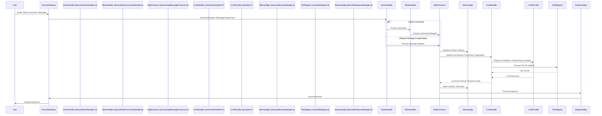

# Message Processing Flow

## Overview

This document explains the typical journey of a user interaction (like a slash command or potentially a message) through the LLMcordTS bot system, from initial receipt to the final response sent back to the user.

## Flow Diagram

## Detailed Flow Steps

1.  **Interaction/Message Receipt:**
    *   The Discord Gateway sends an event (e.g., `InteractionCreate` for slash commands, `MessageCreate` for messages) to the bot.
    *   The corresponding listener in `discord/eventHandlers.ts` receives the event.

2.  **Initial Handling & Routing:**
    *   For slash commands, the `InteractionCreate` handler typically passes the interaction to `discord/slashCommandHandler.ts`.
    *   The Slash Command Handler verifies and parses the command.
    *   For messages (if the bot is configured to listen to them), the `MessageCreate` handler might perform initial checks (e.g., ignore bots, check prefix).
    *   The interaction or message data is then usually passed to the `processing/MessageProcessor.ts`.

3.  **Message Processing (`MessageProcessor.ts`):**
    *   **Context Retrieval:** The processor interacts with the `memory/MemoryManager.ts` to fetch relevant conversation history or user context.
    *   **Command Identification:** It determines if the interaction corresponds to a registered command.
    *   **Handler Invocation:** If a command is identified, the processor invokes the appropriate handler from `commands/handlers/`.

4.  **Command Execution (`commands/handlers/*`):**
    *   The specific command handler executes its logic using the provided arguments and context.
    *   **LLM Interaction:** The handler may call upon an LLM provider via `providers/*` for text generation, analysis, or reasoning.
    *   **Tool Usage:** The handler might use the `core/toolRegistry.ts` to execute a specific tool (`tools/*`) if required by the command or LLM.
    *   The handler prepares the result or data needed for the response.

5.  **Response Formatting & Context Storage:**
    *   The result from the command handler (or potentially the reasoning engine) is passed back to the `MessageProcessor`.
    *   **Context Storage:** The processor interacts with the `MemoryManager` again to store updated conversation history, summaries, or relevant context.
    *   **Response Preparation:** The processor sends the response data to the `discord/ResponseManager.ts`.

6.  **Response Delivery (`ResponseManager.ts`):**
    *   The `ResponseManager` formats the final response appropriately for Discord (e.g., embeds, text messages, ephemeral messages).
    *   It interacts with the Discord API (via Discord.js) to send the formatted response back to the channel or user where the interaction originated.

## Error Handling

Errors can occur at various stages. The general approach is:
*   Log errors using the configured logger (`core/logger.ts`).
*   Attempt to catch errors gracefully to prevent the bot from crashing.
*   Send an informative error message back to the user when appropriate (e.g., "Sorry, something went wrong while processing your command.").